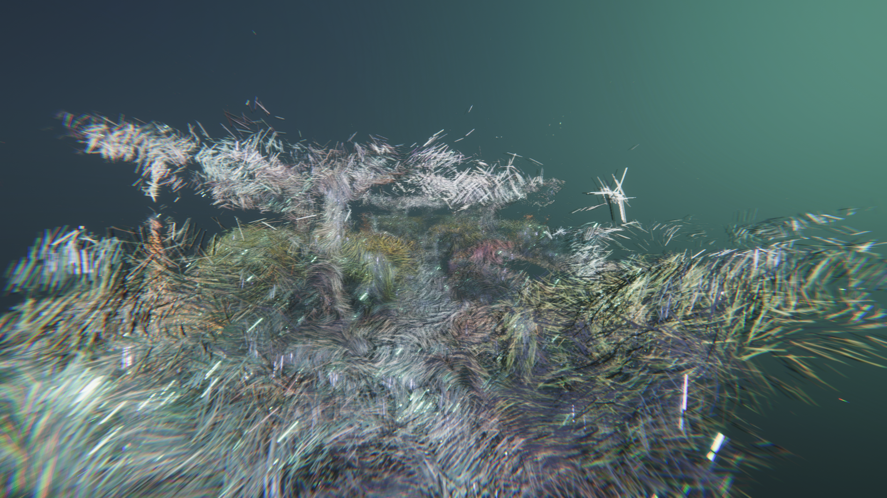

# Unity-Point-Cloud-VFXGraph
I attempted to render point clouds with the VFX Graph in an HDRP scene. This project is based on [Keijiro's Pcx](https://github.com/keijiro/Pcx). Therefore, you can generate colour and point maps from imported ply files, which will be used for your VFX graphs.

