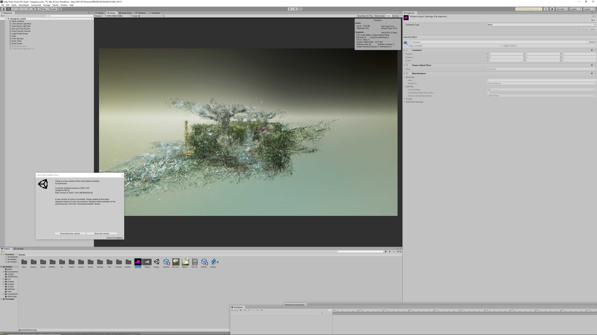
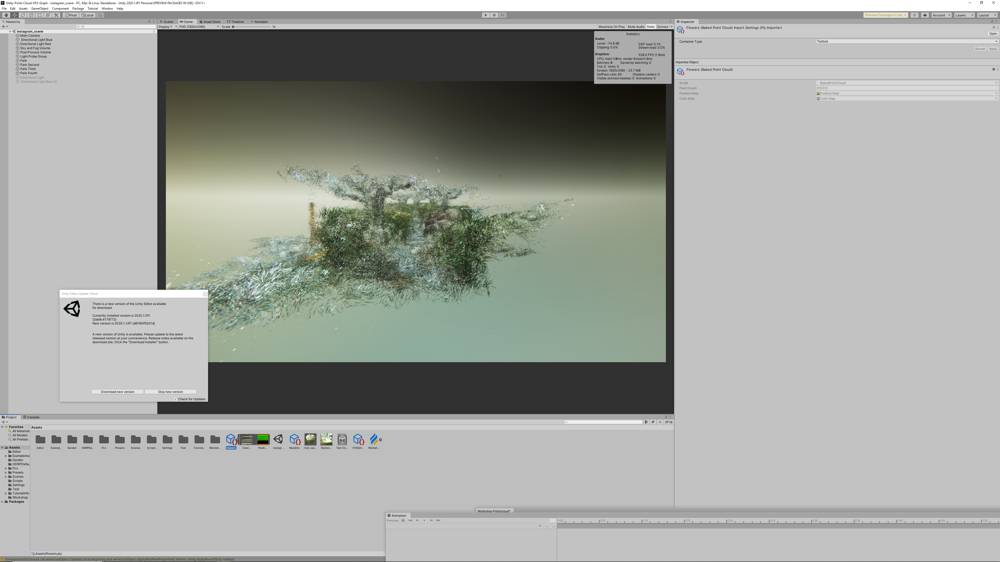

# Unity-Point-Cloud-VFX-Graph
I attempted to render point clouds with the VFX Graph in an HDRP scene. This project is based on [Keijiro's Pcx](https://github.com/keijiro/Pcx). Therefore, you can generate colour and position maps from imported ply files, which will be used for your VFX graphs.

[The original point cloud](https://sketchfab.com/3d-models/point-cloud-garden-7301fb3b8d344b13b015382a1adb884c) was created by ediacara

## Import a PLY file and Generate its colour and position maps
If you don't have any point cloud (ply) file, one of the easiest ways to get it is to visit [Sktechfab](https://sketchfab.com/) and find a downloadable point cloud. Then just drag and drop it into your Unity project. Once it's imported, click on the icon and have a look at the inspector window. By default, it is `Mesh`, so change it to `Texture` and hit `Apply`. Now, expand it and you will see its colour and position textures inside.

### NYU Shanghai Workshop
This repository has been updated in accordance with the workshop I gave to Interactive Media Arts student at NYU Shanghai in October and then I have left some unnecessary files as well in order to have exactly the same project as before. A recording is available [here](https://youtu.be/iqntF9NPqLw).
